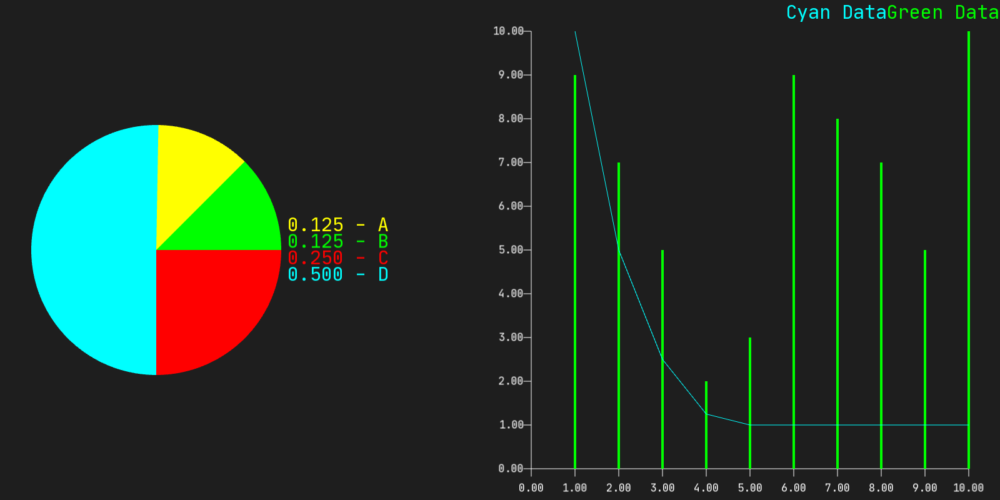
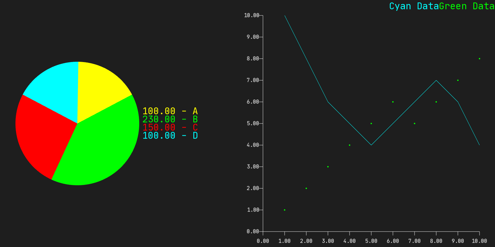
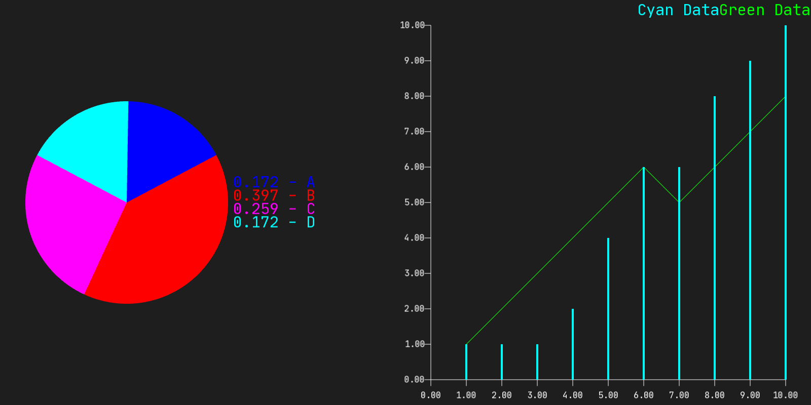

<h1 align="center">SFGraphing</h1>

<p align="center">


</p>

<p align="center">
A C++ Plot Library to be used in combination with SFML
</p>

<p align="center">
    
    
    
</div>

<h2 align="center">Newest Version</h2>

<p align="center">
Entirely rewritten for better readability.  <br>
Added <b>Piecharts</b>! <br>
You can now set Position and Dimension of Plots
</p>

<h2 align="center">How to use</h2>

Documentation at: https://jerr-it.github.io/SFGraphing/<br>

The file main.cpp provides more details on how to use this library

By default a sample program will be created.

How to compile this example <br>
```
cmake .
make graphing
./graphing
```
<b>Depending on your OS and installation, you might need to adjust the SFML path in SFPlot/CMakeLists.txt to fit your installation of SFML.</b><br>
Include header in your main file
```c++
#include "SFGraphing/SFPlot.h"
#include "SFGraphing/SFPieChart.h"
```

Important: You need a font, otherwise text wont display!
```c++
sf::Font font;
font.loadFromFile("YourFontHere.ttf");
```

<h2 align="center">Plot</h2>

Create a dataset
```c++
std::vector<float> xAxis = {1, 2, 3, 4, 5, 6, 7, 8, 9, 10};
std::vector<float> yAxis = {1, 2, 3, 4, 5, 6, 5, 6, 7, 8};

PlotDataSet set(xAxis, yAxis, sf::Color::Green, "Green Data", PlottingType::LINE);
```
Available plotting types are POINTS, LINE and BARS

Create your plot and add your dataset
```c++
//Position, dimension, margin, font
SFPlot plot(sf::Vector2f(800, 0), sf::Vector2f(800, 800), 50, &font, "X Axis", "Y Axis");
plot.AddDataSet(&set);
```

Initialize the plott
```c++
//x-minimum, x-maximum, y-minimum, y-maximum, x-step-size, y-step-size, Color of axes
plot.SetupAxes(0, 10, 0, 10, 1, 1, sf::Color::White);
plot.GenerateVertices();
```
In case you want SFPlot to determine the axes scaling and numbering automatically, call without parameters:
```c++
plot.SetupAxes();
plot.GenerateVertices();
```
Display data (int your window loop)
```c++
window.clear();
window.draw(plot);
window.display();
```
Want to update data in real time?
```c++
window.clear();
plot.ClearVertices();

set.SetDataValue(0, set.GetDataValue(0) + sf::Vector2f(0, 0.001));

plot.SetupAxes();
plot.GenerateVertices();

window.draw(plot);
window.display();
```

<h2 align="center">Pie Chart</h2>

Create dataset
```c++
std::vector<float> values = {100, 230, 150, 100};
std::vector<sf::Color> colors = {sf::Color::Blue, sf::Color::Red, sf::Color::Magenta, sf::Color::Cyan};
std::vector<std::string> labels = {"A", "B", "C", "D"};
//Representations: ABSOLUTE, RELATIVE
PieChartDataSet pSet(values, labels, Representation::RELATIVE, colors);
```
Create PieChart
```c++
//Dataset, Position, Radius, Font
SFPieChart pChart(&pSet, sf::Vector2f(250, 400), 200, &font);
```
Initialize
```c++
pChart.GenerateVertices();
```
Display
```c++
window.clear();
window.draw(pChart);
window.display();
```
Update data in real time?
```c++
window.clear();
pChart.ClearVertices();

pSet.SetValue(0, pSet.GetValue(0) + 0.003);

pChart.GenerateVertices();
window.draw(pChart);
window.display();
```
