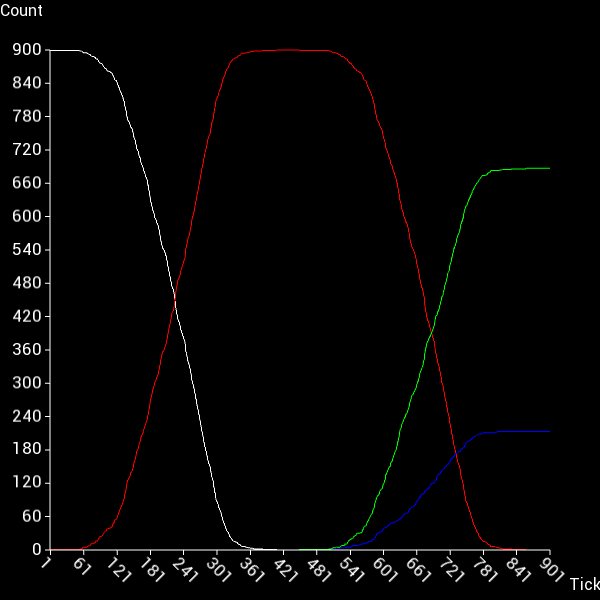
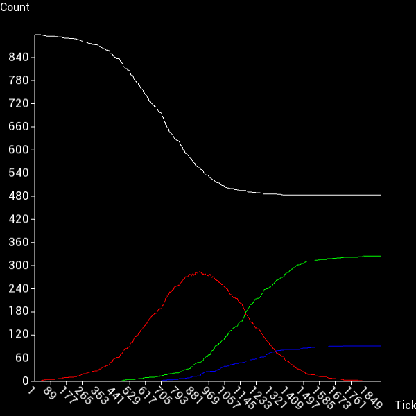

# SFPlot
A C++ Plot Library to be used in combination with SFML

# How to use
The file main.cpp provides an example of how to use this library

Create your data  
```c++
std::vector<double> data1 = {0, 50, 25, 17.5, 9, 4, 2, 1, 1, 1, 1};
DataSet set1(data1, sf::Color::Red, "Data1");
```  
Create a SFPlot and plot your data, font is a sf::Font  
```c++
SFPlot plotter(xax, "X Axis Label", "Y Axis Label", 50, &font);
plotter.plot(set1);
```  
In case you want to limit the plots size, instead of it filling the window use:
```c++
plotter.overrideWindowSize(400,400);
```
Call setup, window is a sf::RenderWindow  
```c++
plotter.setup(&window, PlotType::Line);
```  
In your window loop:  
```c++
window.clear();
plotter.RenderTo(&window);
window.display();
```
## Example Plots


